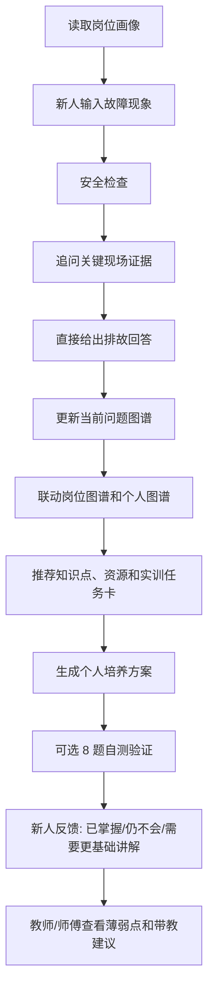

# Optimized MVP Spec

## 优化后的产品定义

本 MVP 从“机电一体化学生诊断工具”优化为：

**面向职业新人的问答式岗位任务培训智能体。**

首个岗位：

```text
自动化生产线装调与运维技术员
```

首个岗位任务：

```text
传感器 NPN/PNP 接线与 PLC 输入信号排查
```

首个训练对象：

```text
高职机电一体化实训学生
入职 0-6 个月自动化设备调试新人
转岗到产线运维岗位的新员工
```

## 需求如何被解决

用户需求是“面向职业新人的培训，要根据岗位进行教学”。优化后的解决方式是：

```text
岗位画像
  -> 岗位任务
  -> 聊天提问/追问
  -> 现场证据追问
  -> 直接排故回答
  -> 岗位能力图谱 + 学生个人能力图谱
  -> 当前问题能力/知识缺口
  -> 实训任务卡
  -> 个人培养方案
  -> 可选自测
  -> 教师/师傅反馈
```

这意味着系统不再从“课程章节”开始，而是从“新人要胜任的岗位任务”开始。

## MVP 核心闭环



## MVP 必须具备的 6 个功能

### 1. 岗位画像展示

系统启动后先展示：

- 岗位名称。
- 新人阶段。
- 典型岗位任务。
- 当前 MVP 聚焦任务。
- 对应课程支撑。

数据来源：

```text
knowledge/job_profiles.json
```

### 2. 双能力图谱

能力图谱分为两个部分：

- **岗位能力图谱**：围绕岗位任务展示能力链，并接入企业/行业/课程标准/教师整理的需求快照。
- **学生个人能力图谱**：根据学生问答命中的能力点、诊断题错因和反馈状态，标记已掌握、薄弱、待确认和建议下一步。
- **当前问题图谱**：把本轮问题命中的能力缺口直接画出来，图谱节点可点击并回到聊天追问。
- **自更新证据**：每个个人能力节点包含掌握度、置信度、证据数量、更新时间和更新原因。

岗位主链：

```text
电气安全检查
-> NPN/PNP 传感器类型识别
-> 传感器接线判断
-> PLC 输入公共端判断
-> PLC I/O 地址映射
-> PLC 输入信号监控
-> 输入点无响应故障定位
-> 个性化实训任务推荐
```

数据来源：

```text
knowledge/ability_nodes.json
knowledge/job_profiles.json
knowledge/industry_demand_snapshots.json
data/sessions/{session_id}.json
data/graph_update_events.json
data/job_graph_update_proposals.json
data/job_graph_confirmed_snapshots.json
```

### 3. 问答式 AI 主入口

新人先在聊天主屏自由提问，系统不要求先做题，而是：

- 根据岗位画像回答。
- 先输出安全提醒。
- 最多追问 3 个关键现场状态。
- 状态足够后直接回答可能原因和先检查步骤。
- 把问题反映到能力图谱和知识缺口卡片上。
- 聊天命中的能力点会进入学生个人能力图谱。
- 讲题、练习、任务完成和反馈会作为图谱更新证据。
- 每次回答后提示 2-4 个更有价值的追问。
- 提示可用工具：能力图谱、自测、知识缺口、实训任务、教师摘要。

第一版重点覆盖：

- 传感器灯亮，PLC 输入灯不亮，在线监控不变。
- 传感器灯亮，PLC 输入灯亮，但程序/在线监控不对。
- 传感器灯不亮或不稳定。
- 气缸不动作，需要分电气、程序、气路排查。

### 4. 新人岗位自测

自测分为两类：

- **预设 8 题评分题**：用于确定性评分、薄弱点诊断和教师摘要。
- **个性化练习题**：根据学生当前问答、薄弱能力和知识库条目生成，用于追问学习，不覆盖规则评分。

新人完成 8 道诊断题，系统判断：

- 得分。
- 答对/总题数。
- 反馈等级。
- 薄弱岗位能力。
- 错因解释。

评分原则：

- 单选、多选、排序题按标准答案匹配。
- 薄弱点来自 `scoring_rules.json`。
- LLM 不自由给分。
- 个性化练习题来自 `knowledge/knowledge_50.json` 和能力节点关联知识，题目可点击“问 AI 讲解”回到主对话。

### 5. 安全优先排故

只要输入涉及以下内容，就先输出安全提醒：

- 接线。
- 拆线。
- 通电测量。
- PLC 输入监控。
- 传感器调试。
- 气缸动作。
- 设备排故。

安全提醒必须包括：

- 接线和拆线前先断电。
- 调试前确认急停、气源、电源和设备状态。
- 不确定设备状态时请教师或实训指导人员确认。
- 不指导绕过安全回路、短接保护或带电冒险操作。

### 6. 实训任务卡推荐

每个薄弱能力必须至少推荐：

- 1 个知识点。
- 1 个学习资源。
- 1 个实训任务。
- 1 条安全提醒。
- 1 个可提交成果。

任务推荐不能只说“去学习 PLC”，必须落到一节课内能完成的动作，例如：

```text
填写 I/O 映射表
完成 NPN/PNP 接线判断
完成传感器灯、PLC 输入灯、在线监控三联状态记录
按顺序排查输入点无响应原因
```

### 7. 个性化培养方案

系统根据个人图谱薄弱点生成培养方案，必须包含：

- 优先补强能力。
- 知识点文本讲解。
- 视频资源链接；没有时明确显示“暂无视频资源”。
- 一节课内可完成的实训任务。
- 检查点或复测题。

培养方案只能从能力图谱、知识库、资源库和训练任务中组合，不编造视频链接。

### 8. 岗位图谱更新建议

教师可导入企业岗位描述、招聘 JD 或行业要求，系统生成岗位能力更新建议。

- 未确认建议只显示为待确认，不改变正式岗位图谱。
- 教师确认后写入本地确认快照，并影响岗位能力图谱权重。
- 每条建议保留来源、证据、建议动作和确认人。

### 9. 教师/师傅摘要

系统汇总演示会话，输出：

- 反馈数量。
- Top 薄弱能力。
- 共性错因。
- 下一节课或下一次带教建议。

第一版用本地 session JSON，不做账号系统和班级后台。

## 首版 API

```text
GET  /api/health
GET  /api/job-profile
GET  /api/quiz
POST /api/quiz/personalized
GET  /api/graph
GET  /api/graph/job
GET  /api/graph/student?session_id=
GET  /api/graph/updates?session_id=
GET  /api/knowledge/search?query=
POST /api/assist
POST /api/chat/start
POST /api/chat/message
POST /api/graph/student/event
POST /api/graph/job/proposals
POST /api/graph/job/proposals/confirm
POST /api/plan/personalized
POST /api/score
POST /api/diagnose
POST /api/feedback
GET  /api/teacher/summary
```

## 首版页面结构

页面名：

```text
机电实训排故导航智能体
```

布局：

```text
主屏：聊天消息流 + 自由输入框
顶部：岗位身份
右侧工具：岗位画像 + 现场状态 + 能力图谱 + 知识缺口 + 实训任务 + 自测 + 教师摘要
工具展示：点击右侧功能入口后进入全屏工作台，占满浏览器视口
图谱工作台：岗位能力图谱 + 个人能力图谱 + 当前问题图谱
图谱详情：图谱 / 更新日志 / 证据解释 / 节点半屏详情
自测工作台：个性化练习题 + 预设 8 题评分
培养方案工作台：知识讲解 + 视频资源 + 实训任务 + 检查点
```

## 首版演示脚本

输入故障现象：

```text
传感器动作灯亮，但 PLC 输入点和在线监控都没有变化。
```

系统应展示：

1. 目标岗位是自动化生产线装调与运维技术员。
2. 触发安全提醒。
3. 先追问传感器灯、PLC 输入灯和在线监控状态。
4. 补充状态后直接回答先查接线、公共端还是地址映射。
5. 显示当前问题图谱并高亮能力缺口。
6. 打开岗位能力图谱，查看岗位要求及企业/行业需求来源。
7. 打开个人能力图谱，查看本次问答和自测形成的薄弱点。
8. 显示对应知识缺口卡片。
9. 推荐一节课实训任务。
10. 点击题目讲解，个人图谱增加“正在提升”证据。
11. 生成个性化练习题，并通过“问 AI 讲解”继续追问。
12. 生成个人培养方案，展示文本讲解、视频资源、实训任务和检查点。
13. 可选展开 8 道自测题验证掌握情况。
14. 保存“仍不会”等反馈。
15. 教师/师傅摘要显示共性薄弱点。

## 暂不做

- 不做登录注册。
- 不做真实企业员工档案。
- 不做完整 LMS。
- 不做数据库系统。
- 不做真实设备控制。
- 不自动批改 PLC 程序或复杂图纸。
- 不扩展到完整机电一体化课程体系。
- 不一次性覆盖多个岗位。

## 下一步开发优先级

1. 把补救任务卡继续细化为目标、步骤、提交物、评价标准。
2. 教师/师傅摘要增加“下一次带教建议”。
3. 定期把真实企业岗位需求补充进 `industry_demand_snapshots.json`。
4. 用真实资源替换 `project_curated_video_placeholder` 视频链接。
5. 给知识缺口卡片增加更直观的图标或关系线。
6. 优化大模型提示词和多轮对话记忆。
