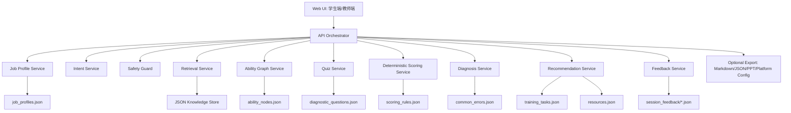
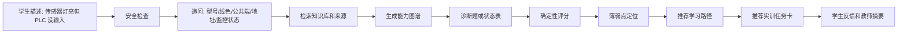

# Product Innovation Architecture

## 产品定位

产品暂定名：**机电实训排故导航智能体**

一句话定位：

面向机电一体化职业新人，把“自动化生产线装调与运维技术员”岗位中的“传感器 NPN/PNP 接线与 PLC 输入信号排查”任务，转化为可解释的能力图谱、确定性诊断评分、薄弱点定位、学习路径和实训任务推荐。

它不是普通知识库问答，也不是大型 LMS。核心价值是把“岗位任务和现场故障现象”变成“职业新人能力缺口”和“下一步实训动作”。

## 结合现有方案后的核心判断

| 现有方案 | 可借鉴能力 | 我们的产品化改造 |
| --- | --- | --- |
| Dify / FastGPT | 工作流拆分、知识库节点、工具调用 | 自研轻量 orchestrator，把流程固定为 Intent、Clarify、Retrieve、Graph、Quiz、Score、Diagnose、Recommend、Feedback |
| RAGFlow / 教育 RAG | 文档检索、引用溯源、可解释回答 | 所有专业结论绑定 `source`，检索结果必须返回知识条目和来源 |
| LangGraph | 状态流转、人类审核、节点图 | 不引入重框架，自己维护 `session_state`，保留教师确认入口 |
| GraphRAG / Adaptive KG | 图谱关系、前置知识、学习路径 | 用 JSON 做轻量岗位能力图谱，不上 Neo4j；Mermaid 做可视化 |
| PAL / EduAdapt | 诊断、掌握度、个性化路径 | 第一版用确定性错题规则替代复杂模型，保证可解释 |
| Pomegranate / Persimmon | 本地文件优先、插件化、Git 协作 | 知识库、题库、规则、会话样例都保存在仓库文件中 |
| BSC-Nav 类研究 | 输入信号、图记忆、下一步导航 | 借鉴“证据记忆 -> 图推理 -> 下一步动作”，用于排故导航 |

## 核心创新功能

### 1. 岗位能力链路引擎

传统问答系统回答“什么是 NPN/PNP”。我们的系统回答“职业新人当前卡在哪个岗位能力链路上”。

能力链路固定为：

```text
电气安全检查
  -> NPN/PNP 传感器类型识别
  -> 传感器接线判断
  -> PLC 输入公共端判断
  -> PLC I/O 地址映射
  -> PLC 输入信号监控
  -> 输入点无响应故障定位
  -> 个性化实训任务推荐
```

实现方式：

- 读取 `knowledge/ability_nodes.json`。
- 使用 `prerequisites` 建立前置能力链。
- 将错题、知识点、常见错误和训练任务映射到能力节点。
- 输出 Mermaid 能力图谱和结构化节点状态。

### 2. 安全优先排故导航

机电实训不能只给技术建议，必须先处理安全边界。

创新点：

- 只要用户输入涉及接线、拆线、通电测量、PLC 监控、气缸动作或设备调试，系统先触发安全检查。
- 推荐排故步骤时，安全节点永远排在第一步。
- 禁止输出绕过安全回路、短接保护、带电冒险操作等建议。

第一版实现：

- `safety.py` 检测关键词和意图。
- 输出统一 `safety_notice`。
- 推荐路径中自动补入 `电气安全检查` 和 `断电与隔离确认`。

### 3. 三联状态对照排故

学生常见错误是“传感器动作灯亮，就以为 PLC 已收到信号”。我们把现场排故抽象成三联状态对照：

```text
传感器动作灯
  + PLC 输入指示灯
  + PLC 在线监控状态
  -> 判断故障落点
```

可定位的故障落点：

- 传感器侧：检测距离、目标材质、输出类型、输出端电压。
- 接线侧：三线制线色、输出线、公共端组别。
- PLC 输入侧：输入模块、输入灯、公共端。
- 程序侧：I/O 地址、变量引用、常开/常闭触点。

这是本产品最贴近实训现场的功能，比纯 RAG 更像“排故导航器”。

### 4. 确定性诊断评分与可解释弱点

评分不交给 LLM 自由判断，而是由规则表决定。

输入：

```json
{
  "answers": {
    "Q001": "B",
    "Q002": ["A", "C"]
  }
}
```

输出：

```json
{
  "score": 75,
  "weak_abilities": [
    {
      "ability_id": "A02",
      "ability_name": "NPN/PNP 传感器类型识别",
      "reason": "NPN/PNP 输出类型与公共端关系判断错误"
    }
  ],
  "recommended_path": ["电气安全检查", "NPN/PNP 传感器类型识别", "接线图判断训练"]
}
```

实现方式：

- 标准答案来自 `diagnosis/diagnostic_questions.json`。
- 弱点映射来自 `diagnosis/scoring_rules.json`。
- LLM 只负责解释，不负责改分。

### 5. 薄弱点到一节课实训任务推荐

很多学习路径系统只推荐视频或知识点。我们的路径必须落到实训任务。

推荐逻辑：

```text
错题
  -> weak_abilities
  -> prerequisite abilities
  -> related_knowledge
  -> related_tasks
  -> resources
  -> 一节课内可完成的实训任务卡
```

输出应包含：

- 先补哪个能力。
- 看哪条知识。
- 做哪个训练任务。
- 本次训练的安全提醒。
- 教师如何观察学生是否达标。

### 6. 证据链式回答

所有专业结论都应能追到来源，不让系统像普通聊天机器人一样“说得像真的”。

每次回答保留：

- `knowledge_refs`
- `ability_refs`
- `question_refs`
- `task_refs`
- `source`

第一版不做复杂引用系统，但 API 输出必须带这些字段。

### 7. 教师反馈与专业建设反哺

学生端解决“我下一步练什么”，教师端解决“班级下一节课补什么”。

教师视图输出：

- 班级 Top 3 薄弱能力。
- 对应常见错误。
- 下一节课补救任务。
- 哪些知识点需要重新讲。
- 哪些实训任务需要增加演示或检查表。

这让产品从“学生自测工具”升级为“实训教学改进工具”。

## 总体架构



## 分层架构

### 1. 表现层

学生端：

- 问题输入
- 信息追问
- 诊断答题
- 能力图谱
- 得分与薄弱点
- 学习路径与任务卡
- 反馈按钮：已掌握、仍不会、需要更基础讲解

教师端：

- 班级答题摘要导入
- Top 薄弱点
- 共性错误
- 补救教学建议
- 下一节课实训任务

### 2. 工作流层

自研轻量 orchestrator，维护统一状态：

```json
{
  "session_id": "SAMPLE-001",
  "role": "student",
  "user_input": "",
  "intent": "",
  "requires_safety_notice": false,
  "clarified_context": {},
  "retrieved_knowledge": [],
  "ability_graph": {},
  "quiz_answers": {},
  "score_result": {},
  "weak_abilities": [],
  "recommended_path": [],
  "feedback": ""
}
```

### 3. 领域服务层

| 服务 | 职责 | 第一版实现 |
| --- | --- | --- |
| Job Profile Service | 提供目标岗位、典型任务、课程映射和训练阶段 | 读取 `job_profiles.json` |
| Intent Service | 判断咨询、诊断、测验、图谱、路径、教师视图 | 关键词规则 + prompt 资产 |
| Safety Guard | 判断是否需要安全提醒 | 关键词规则 |
| Retrieval Service | 检索知识条目和来源 | JSON 关键词检索 |
| Ability Graph Service | 生成能力链和 Mermaid | 读取 `ability_nodes.json` |
| Quiz Service | 输出诊断题 | 读取题库 JSON |
| Scoring Service | 判分和弱点映射 | 复用现有 JS/Python 评分逻辑 |
| Diagnosis Service | 解释薄弱点和常见错误 | 规则 + 知识引用 |
| Recommendation Service | 推荐路径、资源、实训任务 | ability/task/resource 映射 |
| Feedback Service | 保存反馈并生成教师摘要 | 本地 JSON 文件 |

### 4. 数据资产层

第一版直接使用仓库文件：

```text
knowledge/
  job_profiles.json
  ability_nodes.json
  knowledge_50.json
  resources.json
  training_tasks.json
  common_errors.json
diagnosis/
  diagnostic_questions.json
  scoring_rules.json
prompts/
  *.md
data/
  sessions/
```

暂不使用数据库。需要演示历史记录时，保存为 session JSON。

## 核心流程



## API 草案

```text
GET  /api/health
GET  /api/abilities
GET  /api/knowledge/search?query=
GET  /api/quiz
POST /api/score
POST /api/session/start
POST /api/session/diagnose
POST /api/session/recommend
POST /api/session/feedback
GET  /api/teacher/summary
```

## 第一版页面

### 学生诊断页

核心区域：

- 左侧：学生输入和诊断题。
- 中间：能力图谱。
- 右侧：得分、薄弱点、推荐路径。
- 底部：实训任务卡和反馈按钮。

### 教师视图页

核心区域：

- 班级薄弱能力排行。
- 错题和常见错误统计。
- 下一节课教学建议。
- 推荐实训任务清单。

## 首版开发边界

必须做：

- 本地 API 能读取现有 JSON。
- 能输出诊断题。
- 能提交答案并返回评分。
- 能根据错题返回薄弱能力和推荐路径。
- 能生成 Mermaid 能力图谱。
- 接线/调试场景必须输出安全提醒。
- 能保存一次反馈样例。

暂不做：

- 登录注册。
- 班级真实后台。
- 大型数据库。
- 自动批改图纸或 PLC 程序。
- 真实设备控制。
- 多专业铺开。

## 建议技术路线

第一阶段建议：

```text
Python FastAPI 或轻量 HTTP Server
  + 原有 JSON 数据
  + 原有确定性评分代码
  + 静态 HTML 页面
```

如果后续界面复杂，再升级为：

```text
Vite/React 前端
  + Python API
  + 本地 JSON/SQLite
```

判断标准：能否在 3 分钟内演示一次完整闭环，而不是技术栈是否华丽。
