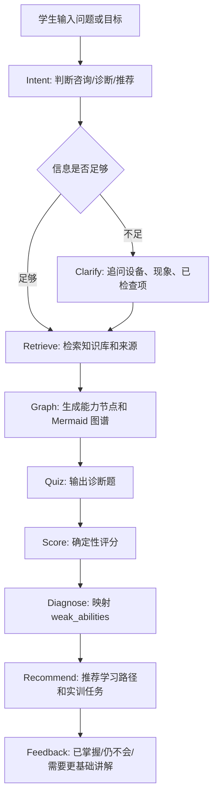

# Related Project Frameworks

## 结论

我们现在不把星辰 Agent 作为必选底座，而是做一个自研轻量 MVP。星辰、Dify、FastGPT 这类平台只作为工作流拆分和导出兼容参考；真正要自己掌握的是数据结构、诊断规则、检索、推荐和界面闭环。

推荐第一版框架：

```text
轻量 Web UI
  -> API/Workflow Orchestrator
  -> JSON Knowledge Store
  -> Retrieval Service
  -> Ability Graph Service
  -> Deterministic Scoring Service
  -> Diagnosis and Recommendation Service
  -> Session Feedback Files
```

第一版不要上 Neo4j、Milvus、大型 LMS、账号系统或通用 Agent 平台。先把“学生输入 -> 追问 -> 能力图谱 -> 诊断题 -> 评分 -> 薄弱点 -> 学习路径 -> 反馈”跑通。

## 已查看项目类型

| 类型 | 代表项目 | 典型框架 | 可借鉴 | 不照搬 |
| --- | --- | --- | --- | --- |
| 通用 LLM 应用平台 | Dify、FastGPT | 应用 UI、工作流编排、知识库、工具调用、发布接口、日志评估 | 多节点工作流、RAG 与工具分离、可视化调试思路 | 不复制整个平台，不把作品做成普通问答应用 |
| RAG 文档引擎 | RAGFlow、Educational_RAG_System、Campus-AI-RAG | 文档解析、切片、索引、检索、重排、引用、生成 | 来源引用、可解释检索、多格式资料进入知识库 | 第一版不做复杂文档解析平台 |
| 有状态 Agent 编排 | LangGraph、Microsoft ai-agents-for-beginners | 状态对象、节点图、条件边、工具节点、人类审核、可恢复执行 | 用状态机管理诊断流程和教师确认点 | 不引入过重编排框架作为第一版依赖 |
| 图谱增强 RAG | Microsoft GraphRAG、Asset Intelligence Graph-RAG | 实体抽取、关系图、社区/子图检索、图上下文增强生成 | 岗位、能力、知识、任务、错误、资源的轻量 schema | 不做自动大规模图谱抽取，不上图数据库 |
| 自适应学习 | PAL 2.0、EduAdapt AI、Adaptive Knowledge Graph | 诊断题、掌握度估计、学习路径、资源推荐、教师模式 | 错题映射薄弱能力，再推荐任务与资源 | 第一版不用强化学习或复杂知识追踪 |
| 知识/桌面工具 | Pomegranate/Knowledge Base、Persimmon/cc-haha | 本地优先、Markdown/文件资产、插件或工具调用、桌面/网页 UI | 本地可控、插件化、文件资产可被 AI 读取 | 不陷入通用笔记软件或通用开发工具开发 |
| 空间记忆/导航研究 | BSC-Nav、SG-Nav、ETP-Nav | 传感器输入、地标/拓扑图、记忆更新、LLM 推理、规划控制 | “事件/证据/能力节点”记忆结构，图推理思想 | 不迁移机器人导航算法本身 |
| 职教资源与标准 | 国家职教平台、专业教学标准、1+X、职业技能标准 | 课程资源、岗位标准、能力要求、考核标准、资源库 | 职教 schema 和来源依据 | 不做资源库平台本身 |

## 各类框架拆解

### 1. 通用 LLM 应用平台

Dify、FastGPT 的核心不是某个算法，而是把 AI 应用拆成可配置模块：

```text
用户输入
  -> 意图/条件判断
  -> 知识库检索
  -> 大模型生成
  -> 工具或代码调用
  -> 结构化输出
  -> 日志与评估
```

对我们有用的是“流程拆节点”。我们的节点应固定为：

```text
Intent -> Clarify -> Retrieve -> Graph -> Quiz -> Score -> Diagnose -> Recommend -> Feedback
```

区别是：Dify/FastGPT 解决“怎么搭 AI 应用”，我们要解决“职教岗位能力和实训任务怎么建模”。

### 2. RAG 文档引擎

RAGFlow 这类项目强调文档进入知识库的质量：

```text
资料导入
  -> 格式解析
  -> 语义切片
  -> 索引
  -> 检索/重排
  -> 引用来源
  -> 回答生成
```

我们第一版不做复杂文件解析，但必须保留它最重要的思想：每个专业结论都有来源字段。当前 `knowledge_50.json`、`ability_nodes.json`、诊断题和训练任务都应继续保留 `source` 或 `sources`。

### 3. 有状态 Agent 编排

LangGraph 类项目的价值在“状态流转”：

```text
state = {
  user_input,
  intent,
  clarified_context,
  retrieved_knowledge,
  quiz_answers,
  score_result,
  weak_abilities,
  recommended_path,
  feedback
}
```

我们不必第一版引入 LangGraph，但可以自己实现一个轻量 orchestrator：每个 API 函数只读写状态对象，最后把 session 保存为 JSON，方便演示和复盘。

### 4. 图谱增强 RAG

GraphRAG 的启发是让系统理解关系，而不是只查相似文本。我们的轻量图谱不需要图数据库，先用 JSON 表达：

```text
ability_node
  -> prerequisites
  -> related_knowledge
  -> related_questions
  -> related_tasks
  -> common_errors
```

图谱输出用 Mermaid；推荐路径从 `prerequisites` 和错题映射生成，避免 LLM 自由编造。

### 5. 自适应学习

PAL、EduAdapt、Adaptive KG 的共同链路是：

```text
诊断
  -> 掌握度/薄弱点
  -> 学习资源
  -> 练习任务
  -> 再诊断
```

我们的第一版把“掌握度模型”简化成确定性规则：

```text
错题 question_id
  -> ability_id
  -> weak_abilities
  -> recommended_resources
  -> recommended_tasks
  -> recommended_path
```

这样更可解释，也更适合实训评分。

### 6. Pomegranate / Knowledge Base 与 Persimmon / cc-haha

这些项目对我们最大的启发不是业务，而是开发方式：

```text
本地资产优先
  -> 文件可读
  -> 插件/工具扩展
  -> UI 辅助操作
  -> Git 同步协作
```

所以我们应把知识库、诊断题、评分规则、提示词和会话样例全部保存在仓库文件里。这样 Codex、教师和学生 Demo 都能围绕同一份资产工作。

### 7. BSC-Nav 类空间记忆项目

`D:\Desktop\BSC-Nav\思路\思路.md` 中总结的 SG-Nav、ETP-Nav、BSC-Nav 大致框架是：

```text
传感器输入
  -> 地标/waypoint/场景图
  -> 图结构记忆
  -> LLM 或 Transformer 推理
  -> 规划器选择下一步
  -> 执行并更新记忆
```

它和我们的业务不同，但可借鉴“记忆节点”思想：

```text
学生行为/错题
  -> 能力节点
  -> 证据记录
  -> 薄弱点推理
  -> 下一步学习任务
  -> 反馈后更新状态
```

## 我们自己的建议架构

### 前端

第一版做一个简单 Web UI，包含：

- 学生提问/诊断入口
- 诊断题答题页
- 能力图谱 Mermaid 展示
- 得分、薄弱点和推荐路径展示
- 教师视图摘要

前端可以先用静态 HTML 或 Vite/React。若要更快出 Demo，先做静态 HTML + API 调用；若要长期维护，再切到 React。

### 后端

推荐先做轻量 Python API，原因是后续处理 JSON、检索、文档和测试都方便。现有 JS/Python 评分模块继续保留，评分逻辑保持确定性。

建议模块：

```text
app/
  main.py                 API 入口
  services/
    knowledge_loader.py   读取知识库 JSON
    retrieval.py          简单关键词检索
    graph.py              能力图谱与 Mermaid
    scoring.py            调用确定性评分规则
    diagnosis.py          薄弱点解释
    recommendation.py     路径、资源、任务推荐
    safety.py             接线/调试安全提醒注入
  data/
    sessions/             本地会话样例，可选
```

### 数据层

第一版直接使用现有文件：

- `knowledge/ability_nodes.json`
- `knowledge/knowledge_50.json`
- `knowledge/resources.json`
- `knowledge/training_tasks.json`
- `knowledge/common_errors.json`
- `diagnosis/diagnostic_questions.json`
- `diagnosis/scoring_rules.json`

暂不引入数据库。需要保存演示记录时，用 `data/sessions/*.json`。

### API 草案

```text
GET  /api/health
GET  /api/abilities
GET  /api/graph/mermaid
POST /api/retrieve
GET  /api/quiz
POST /api/score
POST /api/recommend
POST /api/session/feedback
```

### 核心流程



## 开发顺序

1. 统一仓库约束：自研优先，星辰可选。
2. 新增本地 API 骨架，只实现健康检查、读取 JSON、评分接口。
3. 把现有 `code_module_scoring.py` 或 JS 逻辑接入 API。
4. 做一个最小学生页面：答题、提交、显示评分和推荐。
5. 加能力图谱 Mermaid 展示。
6. 加检索和安全提醒。
7. 加教师视图和会话反馈。

## 参考链接

- Dify: https://github.com/langgenius/dify
- FastGPT: https://github.com/labring/FastGPT
- RAGFlow: https://github.com/infiniflow/ragflow
- LangGraph: https://docs.langchain.com/oss/python/langgraph/
- Microsoft GraphRAG: https://github.com/microsoft/graphrag
- Adaptive Knowledge Graph: https://github.com/MysterionRise/adaptive-knowledge-graph
- Knowledge Base: https://github.com/bkywksj/knowledge-base/
- cc-haha: https://github.com/NanmiCoder/cc-haha/
