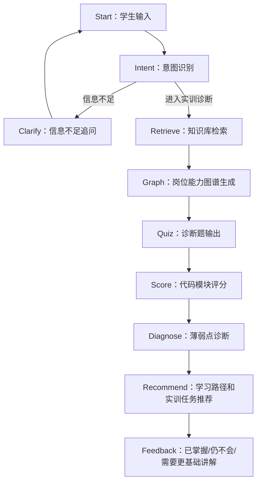

# 星辰工作流蓝图

## 目标

在科大讯飞星辰 Agent 开发平台中实现一个轻量 MVP 工作流，用于“传感器 NPN/PNP 接线与 PLC 输入信号排查”实训闭环。

Codex 只提供离线资产、提示词、知识库、诊断规则、代码模块和测试材料；最终编排、知识库上传、变量映射和发布均在星辰平台人工完成。

## 总体流程



## 全局变量建议

| 变量名 | 说明 | 来源 |
| --- | --- | --- |
| `user_input` | 学生原始输入 | Start |
| `role_hint` | 用户角色，默认 `student` | Start |
| `intent_result` | 意图识别结果 | Intent |
| `clarify_result` | 追问问题 | Clarify |
| `retrieved_knowledge` | 检索到的知识条目 | Retrieve |
| `ability_nodes` | 能力节点 JSON | Knowledge |
| `knowledge_points` | 50 条知识点 JSON | Knowledge |
| `diagnostic_questions` | 8 道诊断题 | Quiz 或静态 JSON |
| `student_answers` | 学生答案，格式为 `{"Q01":"A"}` | Quiz 后用户提交 |
| `score_result` | 代码模块评分结果 | Score |
| `diagnosis_result` | 薄弱点诊断解释 | Diagnose |
| `learning_path_result` | 学习路径和任务推荐 | Recommend |
| `feedback_result` | 最终反馈 | Feedback |

## 节点配置总览

| 节点 | 节点类型 | 输入变量 | 输出变量 | Prompt | 知识库 | 代码模块 | 失败兜底文案 | 星辰人工配置 |
| --- | --- | --- | --- | --- | --- | --- | --- | --- |
| Start：学生输入 | 开始节点/用户输入 | 用户文本 | `user_input`, `role_hint` | 不使用 | 否 | 否 | “请描述你在传感器接线或 PLC 输入监控中遇到的现象。” | 配置欢迎语、输入示例、会话变量 |
| Intent：意图识别 | 大模型节点 | `user_input`, `role_hint`, `conversation_context` | `intent_result` | `prompts/intent_classifier_prompt.md` | 否 | 否 | “我还不能判断你的需求，请补充你是要排故、答题还是生成学习路径。” | 粘贴 Prompt，配置 JSON 输出，设置条件分支 |
| Clarify：信息不足追问 | 大模型节点 | `user_input`, `intent_result`, `known_slots`, `ability_nodes` | `clarify_result` | `prompts/clarify_prompt.md` | 可选 | 否 | “请补充：传感器动作灯、PLC 输入灯、在线监控状态分别是什么？” | 配置触发条件 `intent_result.intent == "clarify"`，输出后回到 Start |
| Retrieve：知识库检索 | 知识库检索节点 | `user_input`, `intent_result`, `score_result` | `retrieved_knowledge`, `ability_nodes`, `knowledge_points`, `resources`, `training_tasks` | 不使用 | 是 | 否 | “未检索到匹配资料，先使用基础排查顺序：安全、电源、传感器、接线、公共端、地址、程序。” | 上传 `knowledge/*.json`，设置 TopK、召回字段和变量名 |
| Graph：岗位能力图谱生成 | 大模型节点 | `ability_nodes`, `knowledge_points`, `score_result`, `focus_abilities` | `graph_result` | `prompts/graph_generator_prompt.md` | 是 | 否 | “暂时无法生成图谱，请按安全检查 -> NPN/PNP 判断 -> 公共端 -> 输入监控 -> 无响应排查学习。” | 粘贴 Prompt，要求 JSON 输出，前端展示 Mermaid |
| Quiz：诊断题输出 | 大模型节点或内容节点 | `diagnostic_questions`, `retrieved_knowledge`, `graph_result` | `quiz_result`, `student_answers` | `prompts/quiz_prompt.md` | 是 | 否 | “诊断题加载失败，请先回答：Q01 PNP 有效输出接近 DC24V 还是 0V？” | 可直接输出 `diagnosis/diagnostic_questions.json`，配置答题收集表单 |
| Score：代码模块评分 | 代码节点 | `student_answers` | `score_result` | 不使用 | 否 | 是：`xingchen/code_module_scoring.js` | “评分暂时失败，请检查答案格式是否为 `{\"answers\":{\"Q01\":\"A\"}}`。” | 粘贴 JS 代码，上传或内置 `diagnostic_questions.json` 和 `scoring_rules.json` |
| Diagnose：薄弱点诊断 | 大模型节点 | `score_result`, `ability_nodes`, `knowledge_points`, `diagnostic_questions` | `diagnosis_result` | `prompts/diagnosis_prompt.md` | 是 | 否 | “评分结果已生成，但解释失败。请先查看 `weak_abilities` 和 `recommended_path`。” | 粘贴 Prompt，强制使用 `score_result.weak_abilities` |
| Recommend：学习路径和实训任务推荐 | 大模型节点 | `score_result`, `diagnosis_result`, `knowledge_points`, `resources`, `training_tasks`, `ability_nodes` | `learning_path_result` | `prompts/learning_path_prompt.md` | 是 | 否 | “建议先完成：电气安全检查、NPN/PNP 识别、接线图判断、PLC 输入监控训练。” | 粘贴 Prompt，配置知识库引用和任务输出格式 |
| Feedback：已掌握/仍不会/需要更基础讲解 | 大模型节点 | `score_result`, `diagnosis_result`, `learning_path_result`, `user_input` | `feedback_result` | 可复用 `prompts/diagnosis_prompt.md` 和 `prompts/learning_path_prompt.md` | 可选 | 否 | “本次反馈：先保证安全，再按推荐路径完成下一次实训。” | 配置最终回答模板，区分学生/教师口吻 |

## 关键节点细节

### Start：学生输入

- 节点名称：Start：学生输入
- 节点类型：开始节点/用户输入节点
- 输入变量：无
- 输出变量：`user_input`, `role_hint`
- 使用 Prompt：不使用
- 是否调用知识库：否
- 是否调用代码模块：否
- 失败兜底文案：`请描述你在传感器接线或 PLC 输入监控中遇到的现象，例如：传感器灯亮但 PLC 输入点没有变化。`
- 星辰人工配置：
  - 设置欢迎语。
  - 设置学生答题输入示例。
  - 将原始输入保存为 `user_input`。

### Intent：意图识别

- 节点名称：Intent：意图识别
- 节点类型：大模型节点
- 输入变量：`user_input`, `role_hint`, `conversation_context`
- 输出变量：`intent_result`
- 使用 Prompt：`prompts/intent_classifier_prompt.md`
- 是否调用知识库：否
- 是否调用代码模块：否
- 失败兜底文案：`我还不能判断你的需求，请补充你是要排故、答诊断题、看能力图谱，还是生成学习路径。`
- 星辰人工配置：
  - 粘贴意图识别 Prompt。
  - 设置 JSON 输出解析。
  - 配置条件分支：`clarify` 进入 Clarify，其余诊断相关意图进入 Retrieve。

### Clarify：信息不足追问

- 节点名称：Clarify：信息不足追问
- 节点类型：大模型节点
- 输入变量：`user_input`, `intent_result`, `known_slots`, `ability_nodes`
- 输出变量：`clarify_result`
- 使用 Prompt：`prompts/clarify_prompt.md`
- 是否调用知识库：可选，优先加载 `knowledge/ability_nodes.json`
- 是否调用代码模块：否
- 失败兜底文案：`请补充三项信息：传感器动作灯是否亮、PLC 输入灯是否亮、在线监控地址是否变化。`
- 星辰人工配置：
  - 设置触发条件：`intent_result.intent == "clarify"` 或 `intent_result.confidence < 0.6`。
  - 输出追问后回到 Start，等待学生补充。

### Retrieve：知识库检索

- 节点名称：Retrieve：知识库检索
- 节点类型：知识库检索节点
- 输入变量：`user_input`, `intent_result`, `score_result`
- 输出变量：`retrieved_knowledge`, `ability_nodes`, `knowledge_points`, `resources`, `training_tasks`
- 使用 Prompt：不使用
- 是否调用知识库：是
- 是否调用代码模块：否
- 失败兜底文案：`未检索到匹配资料，先按基础排查顺序处理：安全、电源、传感器、接线、公共端、地址、程序。`
- 星辰人工配置：
  - 上传 `knowledge/ability_nodes.json`。
  - 上传 `knowledge/knowledge_50.json`。
  - 上传 `knowledge/resources.json` 和 `knowledge/training_tasks.json`。
  - 设置检索 TopK 建议为 5 到 8。
  - 检索字段优先使用 `topic`, `content`, `ability_node_id`, `common_errors`。

### Graph：岗位能力图谱生成

- 节点名称：Graph：岗位能力图谱生成
- 节点类型：大模型节点
- 输入变量：`ability_nodes`, `knowledge_points`, `score_result`, `focus_abilities`
- 输出变量：`graph_result`
- 使用 Prompt：`prompts/graph_generator_prompt.md`
- 是否调用知识库：是
- 是否调用代码模块：否
- 失败兜底文案：`暂时无法生成图谱，请按：电气安全检查 -> NPN/PNP 类型识别 -> PLC 输入公共端判断 -> PLC 输入监控 -> 输入点无响应排查 学习。`
- 星辰人工配置：
  - 粘贴图谱 Prompt。
  - 要求输出 JSON，其中 `mermaid` 字段用于前端或 Markdown 展示。
  - Mermaid 使用 `flowchart TD`，节点文字加引号。

### Quiz：诊断题输出

- 节点名称：Quiz：诊断题输出
- 节点类型：大模型节点/内容节点/表单节点
- 输入变量：`diagnostic_questions`, `retrieved_knowledge`, `graph_result`
- 输出变量：`quiz_result`, `student_answers`
- 使用 Prompt：`prompts/quiz_prompt.md`
- 是否调用知识库：是
- 是否调用代码模块：否
- 失败兜底文案：`诊断题加载失败，请先回答基础题：调整传感器接线前是否应先断电并确认设备状态？`
- 星辰人工配置：
  - 推荐直接使用 `diagnosis/diagnostic_questions.json` 作为题库。
  - 收集答案时统一映射为：`{"answers":{"Q01":"A","Q02":["A","B"]}}`。
  - 多选题可输出数组，也可输出 `"ABCD"`，代码模块均可识别。

### Score：代码模块评分

- 节点名称：Score：代码模块评分
- 节点类型：代码节点
- 输入变量：`student_answers`
- 输出变量：`score_result`
- 使用 Prompt：不使用
- 是否调用知识库：否
- 是否调用代码模块：是，`xingchen/code_module_scoring.js`
- 失败兜底文案：`评分暂时失败，请检查答案格式是否为：{"answers":{"Q01":"A","Q02":["A","B","C","D"]}}。`
- 星辰人工配置：
  - 粘贴 `xingchen/code_module_scoring.js`。
  - 确保代码节点能读取或内置 `diagnosis/diagnostic_questions.json`。
  - 确保代码节点能读取或内置 `diagnosis/scoring_rules.json`。
  - 输入变量绑定为 `student_answers`，输出绑定为 `score_result`。

### Diagnose：薄弱点诊断

- 节点名称：Diagnose：薄弱点诊断
- 节点类型：大模型节点
- 输入变量：`score_result`, `ability_nodes`, `knowledge_points`, `diagnostic_questions`
- 输出变量：`diagnosis_result`
- 使用 Prompt：`prompts/diagnosis_prompt.md`
- 是否调用知识库：是
- 是否调用代码模块：否
- 失败兜底文案：`评分结果已生成，但解释失败。请先查看 score、correct_count、weak_abilities 和 recommended_path。`
- 星辰人工配置：
  - 粘贴诊断 Prompt。
  - 明确禁止模型重新评分。
  - 强制引用 `score_result.weak_abilities`。

### Recommend：学习路径和实训任务推荐

- 节点名称：Recommend：学习路径和实训任务推荐
- 节点类型：大模型节点
- 输入变量：`score_result`, `diagnosis_result`, `knowledge_points`, `resources`, `training_tasks`, `ability_nodes`
- 输出变量：`learning_path_result`
- 使用 Prompt：`prompts/learning_path_prompt.md`
- 是否调用知识库：是
- 是否调用代码模块：否
- 失败兜底文案：`建议先完成：电气安全检查 -> NPN/PNP 传感器类型识别 -> 接线图判断训练 -> PLC 输入监控训练。`
- 星辰人工配置：
  - 粘贴学习路径 Prompt。
  - 将 `score_result.recommended_path` 作为主路径输入。
  - 绑定 `knowledge/training_tasks.json` 用于推荐实训任务。

### Feedback：已掌握/仍不会/需要更基础讲解

- 节点名称：Feedback：已掌握/仍不会/需要更基础讲解
- 节点类型：大模型节点
- 输入变量：`score_result`, `diagnosis_result`, `learning_path_result`, `user_input`
- 输出变量：`feedback_result`
- 使用 Prompt：可复用 `prompts/diagnosis_prompt.md` 与 `prompts/learning_path_prompt.md`，或在星辰中配置最终回答模板
- 是否调用知识库：可选
- 是否调用代码模块：否
- 失败兜底文案：`本次反馈：先确认安全，再按推荐路径完成下一次实训；如果仍不会，请从电气安全和 NPN/PNP 基础重新学习。`
- 星辰人工配置：
  - 配置最终输出模板。
  - 按 `score_result.feedback_level` 区分：
    - `掌握较好`：输出已掌握与巩固任务。
    - `需要专项训练`：输出仍不会的薄弱点和专项训练。
    - `需要补基础`：输出更基础讲解路径。

## 最小演示输入

```json
{
  "answers": {
    "Q01": "B",
    "Q02": "ABCD",
    "Q03": "C",
    "Q04": "ABCDE",
    "Q05": "A,B,C,D,E,F",
    "Q06": "A",
    "Q07": "B",
    "Q08": "A B C D"
  }
}
```

## 最小演示输出

```json
{
  "score": 75,
  "correct_count": 6,
  "total_count": 8,
  "feedback_level": "需要补基础",
  "weak_abilities": [
    {
      "ability_id": "A02",
      "ability_name": "NPN/PNP 传感器类型识别",
      "reason": "NPN/PNP 输出类型与公共端关系判断错误"
    }
  ]
}
```

