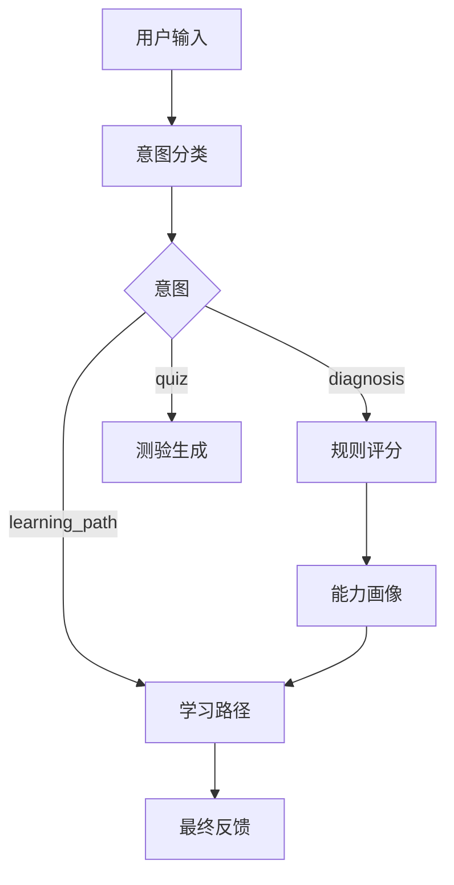
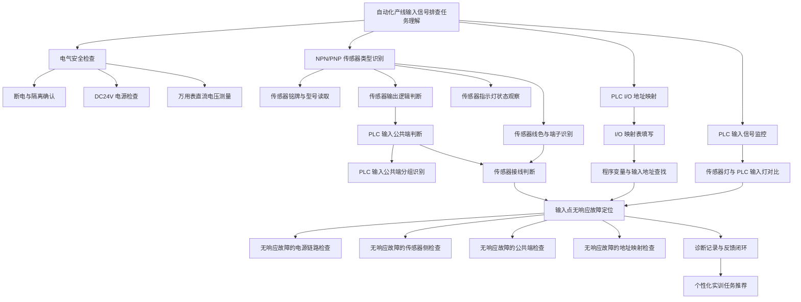
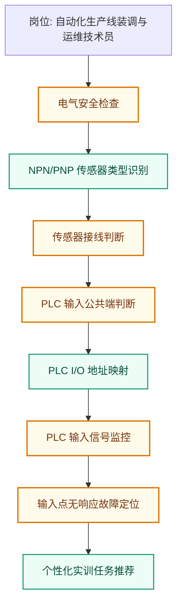
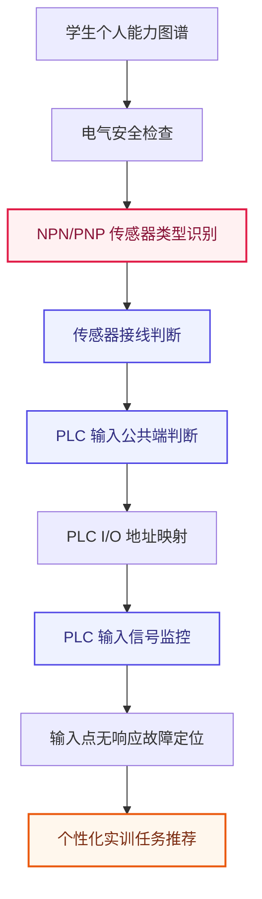

# Mermaid Samples

## MVP Workflow

```mermaid
flowchart TD
  A[用户输入] --> B[意图分类]
  B --> C{意图}
  C -->|diagnosis| D[规则评分]
  C -->|quiz| E[测验生成]
  C -->|learning_path| F[学习路径]
  D --> G[能力画像]
  G --> F
  F --> H[最终反馈]
```

## Ability Graph: NPN/PNP To PLC Input Diagnosis

```mermaid
flowchart TD
  role["自动化产线输入信号排查任务理解"]
  safe["电气安全检查"]
  isolate["断电与隔离确认"]
  dc24v["DC24V 电源检查"]
  meter["万用表直流电压测量"]
  sensor_type["NPN/PNP 传感器类型识别"]
  nameplate["传感器铭牌与型号读取"]
  output_logic["传感器输出逻辑判断"]
  sensor_led["传感器指示灯状态观察"]
  color_code["传感器线色与端子识别"]
  common["PLC 输入公共端判断"]
  grouping["PLC 输入公共端分组识别"]
  wiring["传感器接线判断"]
  mapping["PLC I/O 地址映射"]
  table_build["I/O 映射表填写"]
  program_lookup["程序变量与输入地址查找"]
  monitor["PLC 输入信号监控"]
  led_compare["传感器灯与 PLC 输入灯对比"]
  fault_scope["输入点无响应故障定位"]
  power_path["无响应故障的电源链路检查"]
  sensor_side["无响应故障的传感器侧检查"]
  common_check["无响应故障的公共端检查"]
  address_check["无响应故障的地址映射检查"]
  record["诊断记录与反馈闭环"]
  recommend["个性化实训任务推荐"]

  role --> safe
  safe --> isolate
  safe --> dc24v
  safe --> meter
  role --> sensor_type
  sensor_type --> nameplate
  sensor_type --> output_logic
  sensor_type --> sensor_led
  sensor_type --> color_code
  output_logic --> common
  common --> grouping
  common --> wiring
  color_code --> wiring
  role --> mapping
  mapping --> table_build
  table_build --> program_lookup
  role --> monitor
  monitor --> led_compare
  led_compare --> fault_scope
  wiring --> fault_scope
  program_lookup --> fault_scope
  fault_scope --> power_path
  fault_scope --> sensor_side
  fault_scope --> common_check
  fault_scope --> address_check
  fault_scope --> record
  record --> recommend
```

## Job Ability Graph With Industry Demand

```mermaid
flowchart TD
  role["岗位: 自动化生产线装调与运维技术员"]
  safe["电气安全检查"]
  sensor["NPN/PNP 传感器类型识别"]
  wiring["传感器接线判断"]
  common["PLC 输入公共端判断"]
  mapping["PLC I/O 地址映射"]
  monitor["PLC 输入信号监控"]
  fault["输入点无响应故障定位"]
  task["个性化实训任务推荐"]

  role --> safe
  safe --> sensor
  sensor --> wiring
  wiring --> common
  common --> mapping
  mapping --> monitor
  monitor --> fault
  fault --> task

  classDef hot fill:#fffbeb,stroke:#d97706,stroke-width:2px,color:#78350f
  classDef core fill:#ecfdf5,stroke:#059669,stroke-width:1.5px,color:#064e3b
  class safe,wiring,common,monitor,fault hot
  class sensor,mapping,task core
```

## Student Personal Ability Graph

```mermaid
flowchart TD
  student["学生个人能力图谱"]
  safe["电气安全检查"]
  sensor["NPN/PNP 传感器类型识别"]
  wiring["传感器接线判断"]
  common["PLC 输入公共端判断"]
  mapping["PLC I/O 地址映射"]
  monitor["PLC 输入信号监控"]
  fault["输入点无响应故障定位"]
  task["个性化实训任务推荐"]

  student --> safe
  safe --> sensor
  sensor --> wiring
  wiring --> common
  common --> mapping
  mapping --> monitor
  monitor --> fault
  fault --> task

  classDef touched fill:#eef2ff,stroke:#4f46e5,stroke-width:1.5px,color:#312e81
  classDef weak fill:#fff1f2,stroke:#e11d48,stroke-width:2px,color:#881337
  classDef next fill:#fff7ed,stroke:#ea580c,stroke-width:2px,color:#7c2d12
  class wiring,common,monitor touched
  class sensor weak
  class task next
```
